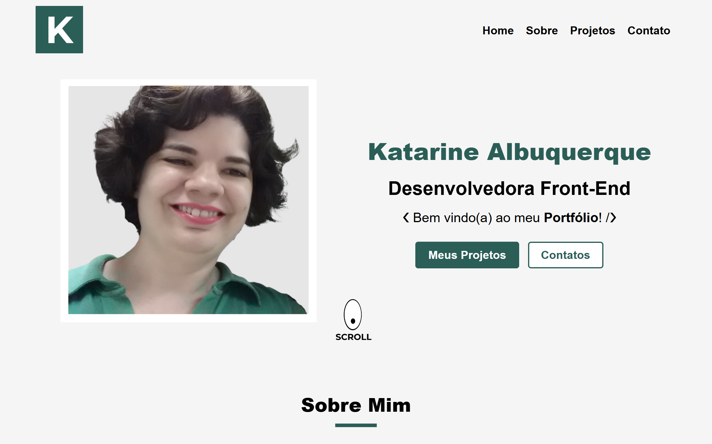

# Portfólio
## Next/ React

 

Acesse o projeto: [Portfólio](https://katarinebalbuquerque.github.io/portfolio/) 

### 1. Sobre o projeto

Desenvolvido em Next.js e React.js, com layout responsivo organizado entre uma e três colunas. Inclui navegação fluida entre seções e páginas, com estrutura otimizada para apresentação clara dos conteúdos.

### 3. Instalação do projeto

Instalar dependências: **npm install**

Rodar aplicação: **npm run dev**

### 4. Contatos

E-mail: [kba.2879@gmail.com](mailto:kba.2879@gmail.com) 
Linkedin: [/katarine-albuquerque](https://www.linkedin.com/in/katarine-albuquerque/)  
GitHub: [/katarinebalbuquerque](https://github.com/katarinebalbuquerque)  
